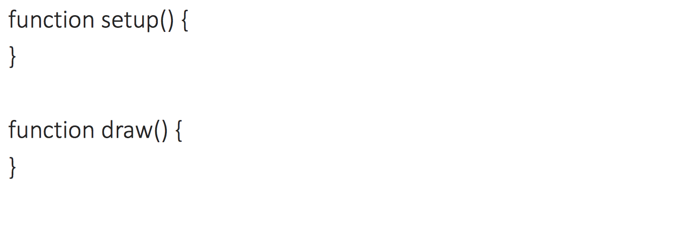
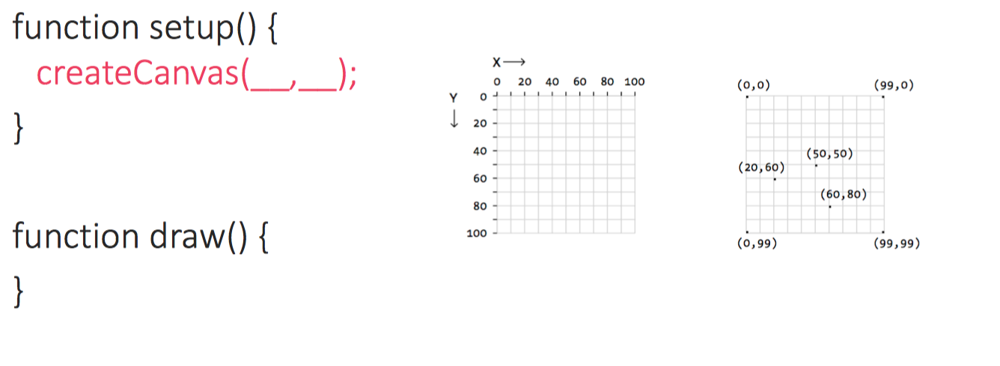
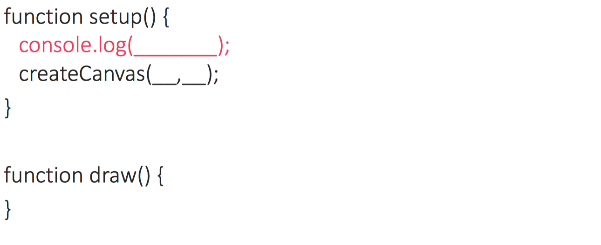
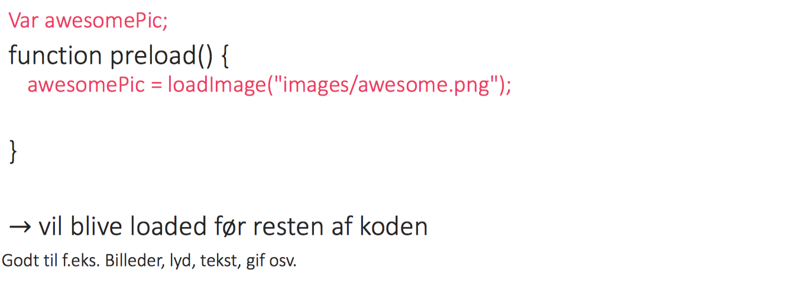
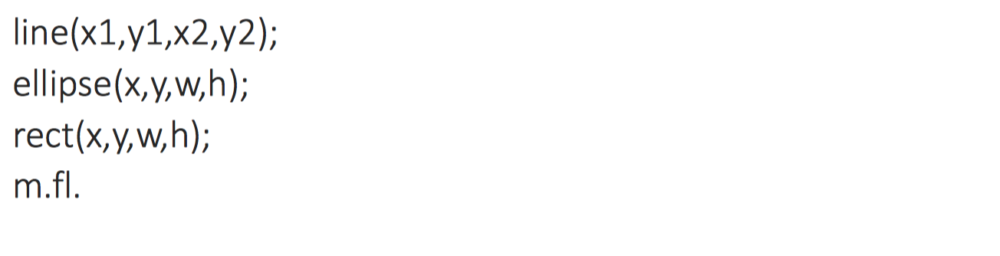

# Engelsholm: Æstetisk Programmerings kursus
- [Aesthetic Programming: A Handbook of Software Studies (2020)](http://openhumanitiespress.org/books/download/Soon-Cox_2020_Aesthetic-Programming.pdf)

- "Learning to code can be
enjoyable and rewarding, but also annoying and frustrating, especially when complex syntax
and structure are involved. It takes time to familiarize oneself with precise, unforgiving
computational logic, and procedures, but hopefully the case for the importance of learning to
program has been established by now. The choice is simple: “to program or be programmed.”" - Winnie Soon 2020

- Målsætning for kursus
	- at kunne skrive kode
	- at kunne læse kode
	- at kunne tænke med kode

## Setup()
- i dette kursus anvender vi en ekstern "code editor" [Visual Studio Code](https://code.visualstudio.com/download) der virker på tværs af pc, mac og linux operativ systemer. Dette gør det nemt at arbejde med p5.js se [
tim rodenbröker creative coding
](https://www.youtube.com/watch?v=vj9nDja8ZdQ&ab_channel=timrodenbr%C3%B6kercreativecoding) video 
- vi anvender [Github]() som en måde for eleverne at kunne dele deres readme og runme filer med hinanden. 
- Ideen med readme er at kunne forklare de tekniske aspekter såvel som de potentielle kritiske konceptuelle aspekter.

### p5.js
1.  gå til p5.js [download page](https://p5js.org/download/) og download p5.js complete library (p5.zip format) der indeholder alle de nødvendige filer til at køre p5.js
2. unzip og extract alle filerne til en ny folder der automatisk hedder "p5".
3.  lav en "work-folder" og placer den på din desktop (kendt sted på computeren)
4. bring folderen "p5" ind i din "work-folder" her vil du kunne se to filer (p5.js) og (p5.min.js)
5. click på folderen "empty-example", og herefter vil du se en liste af filer du skal starte
	- *index.html*, (html Hypertext Markup Language) anvendes til at definerer struktuen for en webside og kan tilpasses til at inkluderer tekst, links, billeder, multimedia og andre elementer.
	- *sketch.js*, den arbejdsfil hvori der skrives JavaScript(JS) kode, ordet "sketch" skal forståes som det gør generelt indenfor arts, altså et lærred hvorpå der kan eksperimenteres med komposition mm.
	- *p5.js*, core library
	- *p5.sound.js*, p5.js sound library, der kan anvendes til web audio funktionalitet, der kan anvendes til playback, eller lytte til at audio input, eller til audio analyse og syntese.

## Draw()
### Programmering med p5.js

### Canvas

### Console

### preload-function

-
## p5 References
[https://p5js.org/reference/](https://p5js.org/reference/)

### Shapes

## Source
- https://github.com/AUAP/AP2017/tree/master/class03